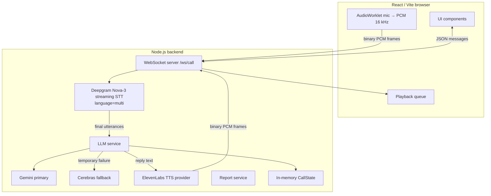

# AI Health Screening Voice Assistant

**Real-time, bilingual (English/Hindi) AI health-screening voice call built with React, Node.js, Deepgram, Gemini/Cerebras, and ElevenLabs.**

The user clicks **Start Call**, grants microphone access, and speaks naturally in English or Hindi. A Node.js backend transcribes the live microphone stream, runs a conversational health-screening conversation with an LLM, synthesizes spoken replies, and produces a structured, non-diagnostic health report at the end of the call.

---

## Table of Contents

1. [Project Title](#1-project-title)
2. [Demo](#2-demo)
3. [Features](#3-features)
4. [Tech Stack](#4-tech-stack)
5. [Architecture](#5-architecture)
6. [Voice Conversation Flow](#6-voice-conversation-flow)
7. [Conversation State Management](#7-conversation-state-management)
8. [Health Screening Logic](#8-health-screening-logic)
9. [Multilingual Support](#9-multilingual-support)
10. [LLM Provider Architecture](#10-llm-provider-architecture)
11. [STT](#11-stt)
12. [TTS](#12-tts)
13. [Health Report](#13-health-report)
14. [Project Structure](#14-project-structure)
15. [Prerequisites](#15-prerequisites)
16. [Environment Variables](#16-environment-variables)
17. [Setup Instructions](#17-setup-instructions)
18. [API Key Setup](#18-api-key-setup)
19. [Running the Application](#19-running-the-application)
20. [Usage](#20-usage)
21. [Error Handling](#21-error-handling)
22. [Known Limitations](#22-known-limitations)
23. [Design Decisions / Trade-offs](#23-design-decisions--trade-offs)
24. [Future Improvements](#24-future-improvements)
25. [Assessment Notes](#25-assessment-notes)
26. [License](#26-license)

---

## 1. Project Title

# AI Health Screening Voice Assistant

A web application where a user has a live, continuous-voice conversation with an AI agent that conducts a basic, non-diagnostic health-screening call. The user speaks naturally in **English or Hindi**, the AI understands, automatically responds in the same language, and a structured health report is generated at the end.

## 2. Demo

Live Demo: Not currently deployed

No screenshots are included in the repository.

## 3. Features

- **Start / End Call buttons** — one-click call lifecycle from the browser.
- **Live, continuous voice conversation** — the microphone stays active for the whole call; there is no push-to-talk.
- **Real-time WebSocket transport** — PCM audio, transcripts, and TTS audio flow over a single WebSocket connection.
- **Streaming speech recognition** — Deepgram Nova-3 (`language=multi`) transcribes audio as it streams.
- **Adaptive health-screening conversation** — the LLM asks one question at a time, adapts to previous answers, and never repeats answered questions.
- **Conversation state management** — the backend explicitly persists state (transcript, collected data, asked questions) across turns.
- **English and Hindi support** — both languages with no manual selection.
- **Automatic language detection** — the LLM detects the language of each finalized utterance.
- **Mid-call language switching** — switching languages does not restart or reconnect the call.
- **Gemini primary LLM** with **Cerebras automatic fallback** for temporary failures.
- **Streaming TTS** — ElevenLabs synthesizes the reply and streams raw PCM audio back to the browser.
- **Barge-in** — speaking while the AI talks interrupts the current synthesis.
- **Structured health report** generated after the call.
- **Graceful handling of incomplete calls** and **localized error handling**.

## 4. Tech Stack

| Layer           | Technology                     | Purpose                                 |
| --------------- | ------------------------------ | --------------------------------------- |
| Frontend        | React 19 + Vite 8 + TypeScript | UI                                      |
| Styling         | TailwindCSS 4                  | Styling                                 |
| Audio capture   | Web Audio API + AudioWorklet   | Microphone → mono 16-bit PCM @ 16 kHz   |
| Backend         | Node.js + TypeScript (Express) | Orchestration, WebSocket, REST API      |
| Transport       | `ws` (WebSocket)               | Real-time audio / message communication |
| STT             | Deepgram Nova-3 (`language=multi`) | Streaming speech-to-text            |
| LLM (primary)   | Gemini (`@google/genai`)       | Conversation + language detection       |
| LLM (fallback)  | Cerebras (`@cerebras/cerebras_cloud_sdk`) | Automatic fallback on temporary errors |
| TTS             | ElevenLabs (REST streaming API) | Text-to-speech, raw PCM output          |
| Validation      | Zod                            | Structured LLM output validation        |
| Testing         | Vitest                         | Backend unit tests                      |

## 5. Architecture



The browser communicates **only** with the Node.js backend over WebSocket (and small REST calls for call creation/report fetching). All Deepgram, Gemini, Cerebras, and ElevenLabs calls happen server-side; **API keys never reach the browser**.

## 6. Voice Conversation Flow

1. The user clicks **Start Call**.
2. The browser requests microphone access and starts continuous capture; the Web Audio API + AudioWorklet converts Float32 samples to **mono 16-bit PCM @ 16 kHz**.
3. The frontend creates a call via `POST /api/calls` and opens a WebSocket to `ws://localhost:5000/ws/call?callId=...`.
4. The backend initializes in-memory call state and opens **one** Deepgram streaming STT connection (`nova-3`, `language=multi`).
5. Mic PCM is streamed to the backend as binary WebSocket frames and forwarded to Deepgram.
6. Deepgram interim transcripts are shown as live captions; final transcripts update the current utterance.
7. When Deepgram emits an utterance end, the finalized transcript is queued and the LLM is called **once** with the full conversation history, current screening state, and current language.
8. **Gemini** generates a structured response. If it fails with a temporary error (rate limit, timeout, server error), **Cerebras** handles the same turn automatically.
9. The extracted data is merged into call state, the conversation language is updated, and the reply text is sent to the browser.
10. The reply is synthesized with ElevenLabs streaming TTS and forwarded as binary PCM frames over the WebSocket.
11. The browser plays the audio through a continuous playback queue.
12. The user speaks again; the loop continues until **End Call**.
13. On End Call, the backend generates a structured health report and sends it to the browser (also retrievable via `GET /api/calls/:callId/report`).

This is a **turn-based** flow (user speaks → processing → AI responds), not a fully duplex call.

## 7. Conversation State Management

Calls are kept in memory in the backend in a `Map<string, CallState>`.

```ts
interface CallState {
  callId: string;
  status: "active" | "ending" | "completed";
  createdAt: number;
  language: "en" | "hi";                  // current conversation language, updated per turn
  messages: ConversationMessage[];        // full transcript
  collectedData: {
    name: string | null;
    mainConcern: string | null;
    duration: string | null;
    severity: string | null;
    relatedSymptoms: string[];
    otherRelevantInformation: string[];
  };
  askedQuestions: string[];               // fields already asked
  report?: HealthReport;
}
```

- The backend **explicitly persists state**; it does not rely on the LLM's memory.
- The full state, conversation history, and current language are sent to the LLM on every turn, so the model sees what has already been asked and answered.
- **No question repetition:** the LLM returns `nextField`, which is recorded in `askedQuestions`; the prompt instructs the model to never re-ask a field already clearly answered.
- **Safe merging:** LLM extraction is merged into `collectedData` without overwriting existing non-null values with `null`, and symptom/notes arrays are de-duplicated.
- Abandoned calls are swept after 30 minutes.

## 8. Health Screening Logic

The assistant attempts to collect, one question at a time:

- Name
- Main concern / primary symptom
- Duration
- Severity
- Related symptoms
- Other relevant information

The conversation is **adaptive**: the next question is chosen by the LLM based on the user's previous answer, and clarification is requested when an answer is vague.

This is a **basic screening/intake tool only**. The LLM is instructed to:

- not diagnose medical conditions;
- not prescribe medication;
- not claim certainty about medical conditions;
- advise seeking urgent medical attention if the user describes potentially serious or emergency symptoms;
- only extract information the user actually stated (never invent missing information).

The report explicitly states it is not a medical diagnosis and should not replace professional medical advice.

## 9. Multilingual Support

English and Hindi are supported with automatic detection and mid-call switching:

```text
User speaks
    ↓
Deepgram multilingual STT (nova-3, language=multi)
    ↓
Transcript
    ↓
LLM determines responseLanguage ("en" | "hi")
    ↓
English / Hindi reply
    ↓
ElevenLabs TTS with the voice for that language
```

- The call always starts in English (`CallState.language = "en"`).
- A **single** Deepgram connection (`language=multi`) transcribes both English and Hindi for the whole call and is **never** reconnected on a language switch.
- After every finalized utterance, the **LLM** (not a separate API) decides whether the utterance is English or Hindi and returns `responseLanguage`. `CallState.language` is updated accordingly and the browser is notified via a `language_changed` message.
- The LLM is instructed **not** to switch languages because of isolated medical terms, names, numbers, or common loanwords (e.g. "मुझे three days से fever है" stays Hindi).
- ElevenLabs selects a voice per utterance: `ELEVENLABS_VOICE_EN` for English, `ELEVENLABS_VOICE_HI` for Hindi.
- The final report is generated in the final conversation language.

Note: very short utterances may occasionally be classified using the previous language (see [Known Limitations](#22-known-limitations)).

## 10. LLM Provider Architecture

The conversation logic depends only on a provider-neutral `LLMProvider` interface (`backend/src/services/llm/provider.ts`); Gemini and Cerebras are interchangeable implementations.

- **Primary:** Gemini (`gemini-3.6-flash` by default)
- **Fallback:** Cerebras (`gpt-oss-120b` by default)

Why the abstraction exists:

- Providers can be swapped or added without touching conversation logic.
- Provider-specific SDK errors are normalized into `LLMProviderError` codes (`RATE_LIMIT`, `AUTH_ERROR`, `TIMEOUT`, `INVALID_RESPONSE`, `SERVER_ERROR`, `UNKNOWN`).
- Conversation state is mapped to provider-neutral input types in `llm.service.ts`.
- **Automatic fallback** is triggered only for temporary errors (`RATE_LIMIT`, `TIMEOUT`, `SERVER_ERROR`):

```text
Gemini
   |
   | rate limit / timeout / server error
   v
Cerebras
```

Non-temporary errors (e.g. auth failure) propagate immediately rather than falling back. If **both** providers fail, the backend sends a localized, controlled error message and the call continues.

## 11. STT

- **Provider:** Deepgram streaming (via `@deepgram/sdk`)
- **Model:** `nova-3` (default `DEEPGRAM_STT_MODEL`)
- **Language:** `multi` (default `DEEPGRAM_STT_LANGUAGE`) — a single connection detects English and Hindi
- **Format:** `linear16`, 16 kHz, mono, interim results on, VAD events on, utterance endpointing (~1 s)
- **Streaming behavior:** audio is processed **during** the call; there is no post-call recording upload.
- **Final transcripts:** only finalized utterances (Deepgram `UtteranceEnd`) trigger an LLM turn; turns are serialized so the LLM is called at most once per utterance. Interim transcripts are shown live but never sent to the LLM.
- **Empty/unclear transcripts:** if the finalized transcript is empty, the AI plays a localized "please repeat" message in the current language — no LLM call is made.

## 12. TTS

- **Provider:** ElevenLabs (official REST streaming endpoint — no SDK dependency)
- **Endpoint:** `POST /v1/text-to-speech/{voice_id}/stream`
- **Model:** `ELEVENLABS_MODEL_ID` (default `eleven_flash_v2_5` — a multilingual model supporting both English and Hindi; `eleven_multilingual_v2` is a higher-quality alternative)
- **Voices:** one per language, configured via environment variables:

```env
ELEVENLABS_API_KEY=
ELEVENLABS_MODEL_ID=eleven_flash_v2_5
ELEVENLABS_VOICE_EN=
ELEVENLABS_VOICE_HI=
```

- **Audio format:** raw `pcm_16000` (16-bit PCM @ 16 kHz), matching the browser playback pipeline. Audio is forwarded progressively in ~80 ms frames, so playback starts before synthesis finishes.
- **Delivery to the browser:** TTS PCM is sent as binary WebSocket frames and played through a continuous playback queue (`frontend/src/hooks/playbackQueue.ts`).
- **Barge-in:** if the user starts speaking, the backend aborts the in-flight synthesis and the browser stops and clears queued audio.
- The voice IDs must be valid ElevenLabs voice IDs available on the account used for `ELEVENLABS_API_KEY` (copy them from the Voices tab in the ElevenLabs app).

If TTS fails, the call does not crash — the AI's text stays visible and the conversation continues.

## 13. Health Report

When the user clicks **End Call**, the backend generates a structured health report. The report is produced by the LLM with structured output (validated with Zod); if the LLM is unavailable, a local fallback summary is used so the call always finishes gracefully.

Report fields:

- `patientName`
- `mainConcern`
- `keySymptoms`
- `duration`
- `severity`
- `followUp`
- `redFlags`
- `otherRelevantInformation`
- `informationCompleteness` — `"limited"` | `"partial"` | `"good"`
- `summary`

**Incomplete calls** (e.g. ending after one or two exchanges) are handled without crashing: `informationCompleteness` is set to `"limited"`/`"partial"`, missing fields are `null` or empty arrays, and the summary reflects that little information was collected.

Example shape:

```json
{
  "patientName": "…",
  "mainConcern": "…",
  "keySymptoms": ["…"],
  "duration": "…",
  "severity": "…",
  "followUp": ["Consider medical evaluation if symptoms persist or worsen."],
  "redFlags": [],
  "otherRelevantInformation": [],
  "informationCompleteness": "partial",
  "summary": "…"
}
```

The report is sent to the browser over the WebSocket and is also retrievable from `GET /api/calls/:callId/report`.

## 14. Project Structure

```text
.
├── backend/                     # Node.js + TypeScript backend
│   ├── .env.example             # Environment template (copy to .env)
│   ├── package.json
│   └── src/
│       ├── server.ts            # Express + WebSocket server, REST API
│       ├── websocket/
│       │   └── callSocket.ts    # Per-call WS session, turn loop, barge-in
│       ├── call/
│       │   ├── callManager.ts   # In-memory call registry + stale sweep
│       │   └── callState.ts     # State creation, merge, de-dup logic
│       ├── config/              # env schema (zod), language, greetings
│       ├── prompts/             # Screening + report system prompts
│       ├── schemas/             # Zod schemas for LLM structured output
│       ├── services/
│       │   ├── deepgramStt.service.ts   # Streaming STT wrapper
│       │   ├── report.service.ts        # Report generation + local fallback
│       │   ├── llm/                     # Provider abstraction + Gemini/Cerebras
│       │   └── tts/                     # Provider abstraction + ElevenLabs
│       ├── types/               # Shared call types
│       └── utils/
│
└── frontend/                    # React + Vite + TypeScript frontend
    ├── package.json
    ├── vite.config.ts           # Dev proxy for /api and /ws -> :5000
    └── src/
        ├── App.tsx              # Screen switching (Start / Call / Report)
        ├── hooks/
        │   ├── useVoiceCall.ts  # WebSocket client + call state machine
        │   ├── micCapture.ts    # AudioWorklet mic → PCM 16 kHz
        │   └── playbackQueue.ts # Continuous PCM playback + barge-in
        ├── services/api.ts      # REST helpers + WS URL builder
        ├── types/call.ts
        └── components/          # StartScreen, CallScreen, Conversation,
                                 # CallStatus, HealthReport
```

## 15. Prerequisites

- **Node.js 20 or newer** and **npm** (the backend runs with `tsx`, which requires a recent Node version).
- A modern browser with microphone access: Chrome, Edge, or Firefox (Safari works but PCM sample-rate behavior varies).
- API keys for the four services below (see [API Key Setup](#18-api-key-setup)).

## 16. Environment Variables

All secrets live in `backend/.env` (copy from `backend/.env.example`). Never expose them to the frontend.

| Variable                               | Required | Default                     | Description                                 |
| -------------------------------------- | -------- | --------------------------- | ------------------------------------------- |
| `BACKEND_PORT`                         | No       | `5000`                      | HTTP + WebSocket port                       |
| `FRONTEND_URL`                         | No       | `http://localhost:5173`     | Allowed CORS origin                         |
| `DEEPGRAM_API_KEY`                     | Yes      | —                           | Deepgram authentication (streaming STT)     |
| `DEEPGRAM_STT_MODEL`                   | No       | `nova-3`                    | Deepgram STT model                          |
| `DEEPGRAM_STT_LANGUAGE`                | No       | `multi`                     | Multilingual (English + Hindi) transcription |
| `LLM_PROVIDER`                         | No       | `gemini`                    | Primary LLM provider                        |
| `LLM_FALLBACK_PROVIDER`                | No       | `cerebras`                  | Automatic fallback provider                 |
| `GEMINI_API_KEY`                       | Yes      | —                           | Gemini authentication (primary LLM)         |
| `GEMINI_MODEL`                         | No       | `gemini-3.6-flash`          | Gemini model                                |
| `CEREBRAS_API_KEY`                     | Yes      | —                           | Cerebras authentication (fallback LLM)      |
| `CEREBRAS_MODEL`                       | No       | `gpt-oss-120b`              | Cerebras model                              |
| `ELEVENLABS_API_KEY`                   | Yes      | —                           | ElevenLabs authentication (TTS)             |
| `ELEVENLABS_MODEL_ID`                  | Yes      | `eleven_flash_v2_5`         | Multilingual TTS model (EN + HI)            |
| `ELEVENLABS_VOICE_EN`                  | Yes      | —                           | ElevenLabs English voice ID                 |
| `ELEVENLABS_VOICE_HI`                  | Yes      | —                           | ElevenLabs Hindi voice ID                   |
| `ELEVENLABS_BASE_URL`                  | No       | `https://api.elevenlabs.io` | ElevenLabs API base URL                     |
| `ELEVENLABS_OPTIMIZE_STREAMING_LATENCY`| No       | `1`                         | Streaming latency optimization level (0–4)  |
| `TTS_SAMPLE_RATE`                      | No       | `16000`                     | Shared PCM sample rate (must match pipeline) |

`DEEPGRAM_API_KEY`, `GEMINI_API_KEY`, `CEREBRAS_API_KEY`, and `ELEVENLABS_API_KEY` are required for the voice pipeline. Both voice IDs are required; if either is missing, calls are refused with a clear error.

## 17. Setup Instructions

```bash
git clone https://github.com/atulj10/HealthCare-voice-assistant.git
cd HealthCare-voice-assistant
```

Backend:

```bash
cd backend
npm install
cp .env.example .env   # then fill in your API keys and voice IDs
```

Frontend:

```bash
cd frontend
npm install
```

## 18. API Key Setup

Create a free account and API key for each service, then paste the keys into `backend/.env`:

- **Deepgram** (STT) — [console.deepgram.com](https://console.deepgram.com): project → API key → `DEEPGRAM_API_KEY`.
- **Google Gemini** (primary LLM) — [aistudio.google.com/apikey](https://aistudio.google.com/apikey): Google account → create API key → `GEMINI_API_KEY`.
- **Cerebras** (fallback LLM) — [cloud.cerebras.ai](https://cloud.cerebras.ai): account → API key → `CEREBRAS_API_KEY`.
- **ElevenLabs** (TTS) — [elevenlabs.io/app/settings/api-keys](https://elevenlabs.io/app/settings/api-keys): account → API key → `ELEVENLABS_API_KEY`.

**ElevenLabs voices:** open [elevenlabs.io/app/voices](https://elevenlabs.io/app/voices), pick an **English** voice and a **Hindi** voice, and copy each voice ID (the 32-character string in the voice's settings/share URL) into `ELEVENLABS_VOICE_EN` and `ELEVENLABS_VOICE_HI`. The model (`ELEVENLABS_MODEL_ID`) must be multilingual (e.g. `eleven_flash_v2_5`).

## 19. Running the Application

Terminal 1 — backend (http://localhost:5000):

```bash
cd backend
npm run dev
```

Terminal 2 — frontend (http://localhost:5173):

```bash
cd frontend
npm run dev
```

Verify the backend: `http://localhost:5000/health` returns `{ "status": "ok" }`, and `http://localhost:5000/api/tts/status` reports whether TTS is configured. The Vite dev server proxies `/api` and `/ws` to the backend, so no CORS configuration is needed locally.

## 20. Usage

1. Open http://localhost:5173.
2. Click **Start Call** and allow microphone access (a secure context is required — `localhost` works).
3. Speak naturally in **English or Hindi**; the assistant follows along and responds out loud in your language.
4. Answer the screening questions (name, main concern, duration, severity, related symptoms).
5. Switch between English and Hindi at any time.
6. Click **End Call**.
7. Review the generated health report.

## 21. Error Handling

| Scenario                         | Behavior                                                                                                   |
| -------------------------------- | ---------------------------------------------------------------------------------------------------------- |
| Microphone permission denied     | The browser shows a "Microphone permission is required" error and the call does not start.                 |
| WebSocket / connection failure   | The UI shows a connection-lost error; if the socket drops mid-call, the backend finalizes the call server-side. |
| STT failure / Deepgram disconnect| A localized error is sent to the browser. Automatic STT reconnection is **not** implemented.               |
| Empty or unclear transcript      | A localized "please repeat" message is played in the current language; no LLM call is made.                 |
| Gemini rate limit / timeout / server error | The same turn is retried automatically with Cerebras.                                    |
| Both LLM providers fail          | A localized error message is shown and the call continues.                                                 |
| TTS failure                      | The AI's text remains visible, `ai_speaking_end` is sent, and the conversation continues.                  |
| Incomplete call                  | A limited report is generated with `informationCompleteness` set appropriately; no crash.                  |
| Missing TTS configuration        | The call is refused with a localized error and the socket closes.                                          |

## 22. Known Limitations

- **Turn-based, not fully duplex** — the conversation is user-speaks → processing → AI-responds. This is explicitly allowed by the assessment.
- **In-memory call state** — calls and reports live only in memory; there is no database, so state is lost on server restart. Production would use a durable store.
- **No authentication or rate limiting** — the REST and WebSocket endpoints are unauthenticated (acceptable for local assessment use).
- **STT reconnection is not implemented** — a Deepgram connection failure is reported to the user; recovery is best-effort.
- **Barge-in is partial** — interrupting stops in-flight synthesis and queued audio, but a tiny tail of already-streamed audio may still be heard.
- **Language detection** is done by the LLM on finalized utterances; very short utterances may occasionally be classified with the previous language.
- **Hindi TTS depends on the account** — a Hindi-capable voice must exist on the ElevenLabs account used; Hindi TTS failure never silently substitutes an English voice.
- **No call recording** — TTS audio is not saved to disk and calls are not recorded.
- **Free-tier limits** — STT, LLM, and TTS calls consume API credits/quotas; heavy use may hit rate limits.
- **Not a diagnostic tool** — the report is a screening summary only and must not replace professional medical advice.

## 23. Design Decisions / Trade-offs

### Why WebSockets?
One WebSocket carries continuous mic audio, live transcripts, and streaming TTS audio — enabling a real-time conversation rather than uploading one recording after the call.

### Why a single multilingual Deepgram connection?
A single `nova-3` connection with `language=multi` transcribes both English and Hindi for the whole call, so language switching requires no reconnect or restart.

### Why the provider abstraction?
Gemini and Cerebras are behind one `LLMProvider` interface with normalized errors, so providers can be swapped or extended without touching the conversation engine.

### Why turn-based processing?
The assessment explicitly allows a user-speaks → processing → AI-response flow. Turn-based processing keeps utterance handling deterministic and reliable within the assessment window.

### Why structured LLM output?
Both the screening turn and the report use schema-validated JSON (Zod), making conversation state and the final report deterministic instead of relying on parsing free-form model text.

### Why keep state on the backend?
The backend explicitly persists call state and merges LLM extraction safely (never overwriting useful data, de-duplicating lists), rather than trusting the LLM to remember everything.

## 24. Future Improvements

- Full-duplex (WebRTC or continuous streaming) conversation with tighter barge-in.
- Persistent call history and reports (e.g. Postgres) with authentication and rate limiting.
- Deepgram STT reconnection with backoff and keepalive pings.
- More robust language detection and code-switching handling.
- Better noise suppression and voice-activity gating.
- Observability: latency/cost metrics per call for STT, LLM, and TTS.
- Production deployment (HTTPS, static hosting of the frontend build, CI/CD).
- Additional screening domains or a multi-step clinical intake template.

## 25. Assessment Notes

| Assessment Requirement             | Implementation                                    |
| ---------------------------------- | ------------------------------------------------- |
| "Start Call" button                | Implemented (frontend + backend orchestration)    |
| "End Call" button                  | Implemented (finalizes the call + generates report) |
| Live / real-time voice interaction | WebSocket + streaming Deepgram STT + streaming TTS |
| STT                                | Deepgram Nova-3 (`language=multi`)               |
| LLM                                | Gemini (primary)                                 |
| LLM fallback                       | Cerebras (automatic on temporary errors)         |
| Health-screening questions         | Name, main concern, duration, severity, related symptoms, other info |
| Adaptive conversation              | Conversation state + LLM-driven question selection |
| English + Hindi support            | Implemented (automatic detection + mid-call switching) |
| Real-time transport                | WebSocket (`/ws/call`)                           |
| Conversation state across turns    | Backend `CallState`, LLM extraction merging      |
| Graceful empty/unclear STT         | Localized "please repeat", no LLM call           |
| Graceful API failures              | LLM fallback, localized errors, TTS non-fatal    |
| Structured health report           | Implemented (Zod-validated, with local fallback) |
| Short/incomplete call handling     | Implemented (`informationCompleteness`, no crash) |
| Report summaries main concern/symptoms/duration/severity/follow-up/red flags | Implemented |

## 26. License

No license file is present in the repository. All rights reserved by the author until a license is added.
